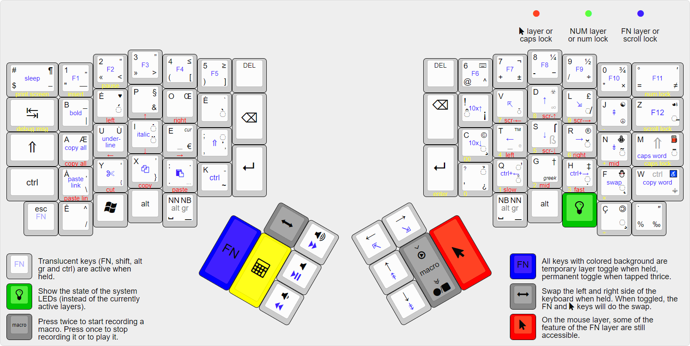

# Bépo compatible keymap for the Ergodox EZ, *TypeMatrix* style.

This repository host a couple of BÉPO layouts for Ergodox keyboards.

This is a QMK *userspace* repo. See the QMK documentation on how to use it:
https://docs.qmk.fm/#/newbs_external_userspace

The keymap here is meant to be used with a [Bépo](http://bepo.fr) layout. It is
designed to be somewhat similar to a TypeMatrix keyboard so that switching
between one and the other is easy.



*This keymap is generated using http://www.keyboard-layout-editor.com.*

You can download the keymap on the
[releases page](https://github.com/mkende/ergodox_bepo_tm_style/releases) or you
can build it yourself with

```sh
qmk compile -j 12 -kb ergodox_ez -km bepo_tm_style
```

The latter, requires that you have set-up the `qmk` CLI tool. See the
[QMK Guide](https://docs.qmk.fm/#/newbs_getting_started) if needed.

The firmware can then be flashed with the following command for example:

```sh
teensy_loader_cli --mcu=TEENSY2 -w ergodox_ez_base_bepo_tm_style.hex
```

Which requires the Teensy CLI program.

## Variants

### Keyboard

The layouts can be built with the `zsa/ergodox_ez/m32u4` keyboard (which is the
default for `zsa/ergodox_ez` or even just `ergodox_ez`). This is the legacy
Ergodox EZ keyboards, pre-2024, using a Teensy-like MCU.

Otherwise, the layouts can be built for the `zsa/ergodox_ez/stm32` keyboard
which correspond to the more recent models, using a STM32 MCU. Note that the
layout code is completely shared between the two keyboards but, technically,
the stm32 variant uses the layouts defined in the `keyboards/zsa/ergodox_ez`
folder intead of the `keyboards/ergodox_ez` folder used by the legacy variants.

The layout is meant to work with an Ergodox EZ *original* (neither *shine* nor
*glow*). However it will probably work with them too.

### Keymaps

The `_no_sleep` variant of the keymap does not have the *sleep* key in the upper
left corner. Instead it has a ctrl + alt + l shortcut.

The `_macos` variant has the same change as the `no_sleep` one and, in addition,
it also uses the classical `CTRL+x/c/v` shortcuts for the cut/copy/paste keys in
the `FN` layer, as the shortcuts used in the default layout are not recognized
under MacOS. It is then expected that the `control` and `command` keys are
swapped at the OS level. This let the layout be the most functionnal under other
operating systems too.
